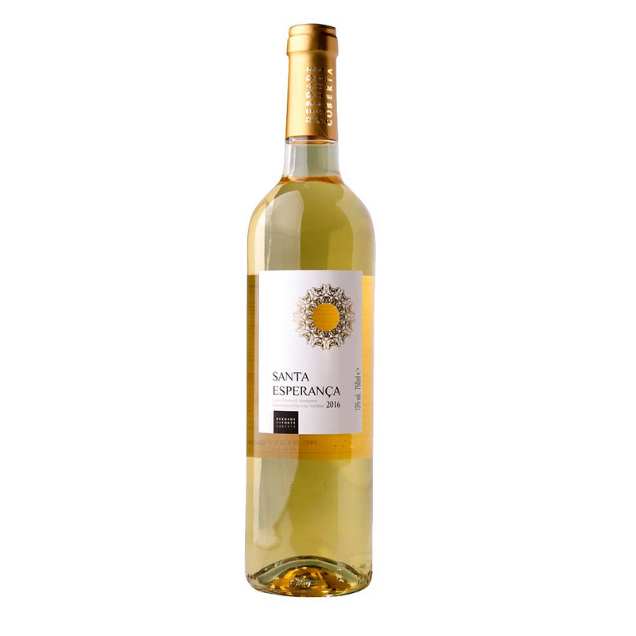

# Adventura Dulcemio Wines


## Table of contents

- [Overview](#overview)
  - [The challenge](#the-challenge)
  - [Screenshot](#screenshot)
  - [Links](#links)
- [My process](#my-process)
  - [Built with](#built-with)
  - [What I learned](#what-i-learned)
  - [Continued development](#continued-development)
  - [Useful resources](#useful-resources)
- [Author](#author)
- [Acknowledgments](#acknowledgments)


## Overview

### The challenge

Users should be able to:

- View the optimal layout for the site depending on their device's screen size
- Add items to the same cart from different pages accross the site
- View the cart, increase the quantity of items and remove items from it

### Screenshot


### Built with

- Semantic HTML5 markup
- CSS custom properties
- Flexbox
- CSS Grid
- Mobile-first workflow
- Vanilla Javascript


### What I learned

I learned how to add different items to a cart, remove items from the cart and increase the quantity of items on the cart using vanilla javascript. I learned how to use localhost to make a cart persistent accross multiple pages. 

After building the page layout, using html and css i started to add the cart functionality to the different wine items on the website.

The cart contained a div with an id #buyItems where the cart items would be added to using javascript. The buyItems div is empty by default with a heading that said "your cart is empty" which disappears when an item is added The cart and reappears when every item has been removed. It  also contained a div with class total-wrapper where the total price of all the items in the cart would be updated.


Each item in the main page is wrapped in a div with a class productItem. The div contains an image, a title with the class productName, a price with the class of price-value, and a button with a class of addBtn which adds an item to the cart on click. Each button is given a unique id in the html using the element data-product-id. Below is a snippet of the cart item

```html 
  <div class="product-item card shadow-sm">
	  
		<div class="product-title card-body">
			<a href="products/product1.html" class="p-title-link">
				<h4 class="productName">Santa Esperanca White</h4>
			</a>
			<div class="product-inner">
				<p class="price">
					&#x20A6;<span class="price-value">2500</span>
				</p>
				<button data-product-id="1" class="add-btn">
					Add  <i class="fas fa-cart-plus"></i> 
				</button>
			</div>
		</div>
	</div>
```
The javascript page consisted of several functions and variables each with a different functionality.
First of all, an empty array is assigned to a variable productsInCart where the products are added.
Then the different elements and divs are called from the DOM 
first the div with the cartItem id is called and assigned to a variable parentElement. then the product item div is called and assigned to a variable named products. The sumtotal div and the cart-notification divs are also called and assigned to their respective variables.

A forEach loop is added to the product variable to loop through all the divs with the classname product-item.
a click event listener is added to the product variable. That is foreach product-item to be clicked. then e.target.classList.contains("add-btn") is used to check if the button clicked on the product item is the add to cart button.
if that is the case then the different elements from the product-item are selected. i.e the productName, the image and the price value. They are all assigned to their respective variables with matching names.The id of the product item is also selected using e.target.dataset.productId.
An object is then created with the name productsToCart. The object contains the keys name, image, id, count, price, and basePrice. with value being the variables of the differnt elements that were selected. 
The other functions are then called in the loop.

```js 
	products.forEach(product => {
	product.addEventListener('click', (e) => {
		if(e.target.classList.contains('add-btn')) {
			const productID = e.target.dataset.productId;
			const productName = product.querySelector('.productName').innerHTML;
			const productPrice = product.querySelector('.price-value').innerHTML;
			const productImage = product.querySelector('img').src;

			let productToCart = {
				name: productName,
				image: productImage,
				id: productID,
				count: 1,
				price: +productPrice,
				basePrice: +productPrice
			};
			addCount();
			updateProductsInCart(productToCart);
			updateShoppingCartHTML();
		};
	});
});


```
The first function is a function to update the product in cart object. It increases the count and changes the price 


```js
function updateProductsInCart(product) {
	for (i = 0; i < productsInCart.length; i++) {
		if (productsInCart[i].id == product.id) {
			productsInCart[i].count += 1;
			productsInCart[i].price = productsInCart[i].basePrice * productsInCart[i].count;
			return;	
		} 
	}
	productsInCart.push(product);
	
}


```

Each product item gotten from the loop of productItems is passed into the function
The function adds the product to the productsInCart array using the push method.
a for loop to go through all the items in the productsInCart array is created.
an if statement is created to check if theres an item in the productsInCart array with the same id as the id of the product item that was selected. if its the case the count is increased by 1 and the price is multiplied by the count using the base price.


Another function created is the updateShoppingCartHtml. This function does the actual updating of items into the shopping cart using actual html in the javascript. It uses the map function to add the html to the buyItem div which was assigned to the variable parentElements. 

```js 
	const updateShoppingCartHTML = function() {
	localStorage.setItem('shoppingCart', JSON.stringify(productsInCart));
	if (productsInCart.length > 0) {
	let result = productsInCart.map(product => {

return `
		<div class="buyItem">
			<div class="product-cart-image"> 
				
			</div>
		
			<div class="product-summary">
				<h5 class="pb-1"><strong>${product.name}</strong></h5>
				<p><strong>Quantity:</strong> ${product.count} </p>
				<p><strong>Price:</strong> &#x20A6;${product.price}</p>
			</div>
			<div class="product-extra">
				
				<div class="quantity-wrapper">
					<button id="addQty" class="addQty change-qty" data-id='${product.id}'>+</button>
					<p class="product-quantity" id="qty"> ${product.count}</p>
					<button id="reduceQty" class="reduceQty change-qty" data-id='${product.id}'>-</button>
				</div>
				<div class="deleteItem">
					<button class="deleteBtn" title="delete item"><i data-id='${product.id}'  class="fas fa-trash"></i></button>
				</div>
			</div>
	</div>`
});
	parentElement.innerHTML = result.join('');
	document.querySelector('.checkout').classList.remove('hidden');
	
	document.querySelector(".total-wrapper").classList.remove('hidden');
	sumTotal.innerHTML = "&#x20A6;" + countTheSumPrice();

	} else {
			document.querySelector('.checkout').classList.add('hidden');
			document.querySelector('.total-wrapper').classList.add('hidden');
			parentElement.innerHTML = '<h4 class="empty">Your cart is empty</h4>';
			
		}
	};

```
the function checks if there are items in the productsInCart array using productsInCart.length and then A variable result is declared and the product from the loop is added to the products in cart array using productsInCart.map(products) and the actual html is returned in this function using backticks and the different properties of the product items are added as variables from the array. i.e the name with product.name, the image with product.image and they are all placed in their respective positions. the result variable is added the the parentElement inner html usin result.join(''); then, still in the if statement. the checkout button and the price total which is hidden by default is made visible by removing the hidden class. also the sumTotal innerhtml is updated by calling a function that updates the sumTotal. Finally, if there are no items in the array, then the checkout button and the total wrapper are hidden again and the innerHTML of the parentElement is set to the statement 'your cart is empty'.

some other functions


The function to update the sumtotal as items are added or removed from the cart. It is written as

```js
const countTheSumPrice = function() {
	let sumPrice = 0;
	productsInCart.forEach(product => {
		sumPrice += product.price;
	});
	return sumPrice;
}
```
a variable sumPrice is declared and set to 0. a for each loop to check all the items cart from the productsInCart array is created. and for each product in the cart the product price is added to the sumPrice, then the sumPrice is returned. remember that the product price is updated for each product by multiplying the price by the count of each item.


The function to add the count to the the cart-notification element inner when an item is selected. the function is called in the click event function that was created initially.
```js
const addCount = function() {
	let countNum = 1;
	productsInCart.forEach(product => {
		countNum += product.count;
	});
	cartNotification.innerHTML = "(" + countNum + ")";
	return countNum;
	
}
```
a variable countNum is declared and initalized to 1. then a for each loop is used to loop through each product in the cart with the productsInCart array. then the product couns is added the the count num variable. the inner html of variable, cartNotification (which was assigned to an element with the class similarly named which is placed next to the cart) is set to the countNum and the countNum is returned.


The function to increase and decrease the count in the cart. 

```js 
	parentElement.addEventListener('click', (e) => {
	const isPlusButton = e.target.classList.contains('addQty');
	const isMinusButton = e.target.classList.contains('reduceQty');
	
	if (isPlusButton || isMinusButton ) {
		for (i=0; i < productsInCart.length; i++) {
			if (productsInCart[i].id === e.target.dataset.id) {
				if (isPlusButton) {
					productsInCart[i].count += 1;
				} else if (isMinusButton) {
					productsInCart[i].count -= 1;
				}
				countNum = productsInCart[i].count;	
				productsInCart[i].price = productsInCart[i].basePrice * productsInCart[i].count;
				
			}	
			if(productsInCart[i].count <= 0 ){
				productsInCart.splice(i, 1);
			}
		}
		addCount();
		updateShoppingCartHTML();
		//deleteBtnFunc();
	}
});

```
first of all an event listener is used to check when an item in the parentElement is clicked. the add and subtract buttons selected and assigned to a variable using fitting names. the buttons are selected using the e.target.classList.contains("classname"). this another way of selecting elements by checking if the item clicked contains a particular class name. then an if statement with that checks which button is clicked between the plus or minus buttons is created. then a for loop to loop through all the items in the productsInCart array. in the for loop an if statement is created to check if the id of the item in the cart is the same as the id of the selected product. then two if statements for each button are created where the productcount is increased by 1 and reduced by 1 depending on which button is clicked. Then the countNum for the notification is set to the productsInCart count. and the productsInCart price is set to the the basePrice multiplied by the count. after the if statement another if statement is created to check if the count of that particular product is equal to zero if so then the item is deletrd from the cart using productsIncart.splice(i, 1). finally the addCount and the updateShoppingCartHtml functions are called.


Another function is the delete item from cart function. it removes the item from the cart and updates the price and the count when clicked. it uses the same approach used in the increase count function. tan event listener is used to check when the delete button (which is an element in the product item, contained in the parentElement) is clicked. the button is selected using the method that checks if a clicked element contains a particular class. the button is assigned to a variable isDeletebtn.
a for loop that loops through all the items in the products in cart array and an if statement to check if the id f the product in the cart is the same as the id of the product item being deleted. then if it is the and the button clicked is the delete button, then the product is deleted using the productsInCart.splice. then the addCount and the updateShoppingCart functions are called 

```js
parentElement.addEventListener('click', (e) => {
	const isDeleteBtn = e.target.classList.contains('fa-trash');

	console.log(isDeleteBtn);
	if (isDeleteBtn) {
		for (i=0; i < productsInCart.length; i++) { 
			if (productsInCart[i].id === e.target.dataset.id) {
				if (isDeleteBtn) {
					productsInCart.splice(i, 1);
					console.log("delete" + e.target.dataset.id);
				}
				
			}
		}
		addCount();
		updateShoppingCartHTML();
		console.log("delete");
	}	
});
```

The last function is the checkOut function. when the button with the class of checkout is clicked, an alert pops up thanking the user. the productInCart array is set to be empty which empties the cart, the parentElement innerHTML is set to the heading informing the user that the cart is empty, the checkout button and the price total wrapper are all hidden. the updateShoppingCartHTML, the addCount, and the closeCart  function are all called,


finally the local storage that makes the cart persistent. the local storage is added to the update shopping cart function. The shopping cart is the key and the productsInCart is the value. since its being stored in JSON format it has to be converted using the strigify method

```js
	localStorage.setItem('shoppingCart',JSON.stringify(productsInCart));
```
the localstorage JSON is stored in the variable productsInCart and its converted back from JSON using parse

```js 
	let productsInCart = JSON.parse(localStorage.getItem('shoppingCart'));;
```

to avoid getting a bug when the shopping cart is empty an if statement is created which sets the productsInCart array to an empty array

```js
if (!productsInCart) {
	productsInCart = [];
}
```
the updateProductsInCartHTML function is then called outside all the function so that it updates the cart on reload
```js
const proudOfThisFunc = () => {
  console.log('🎉')
}
```


### Continued development

I intend to build alot more javascript project and then move to react


## Author

- website - varun


